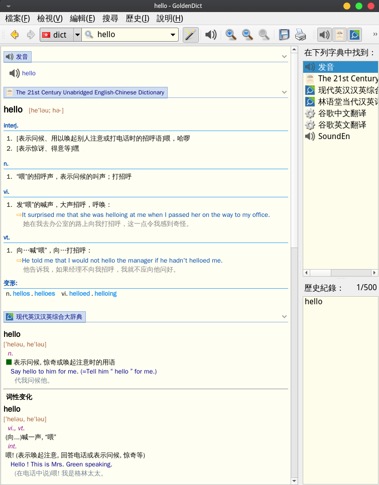
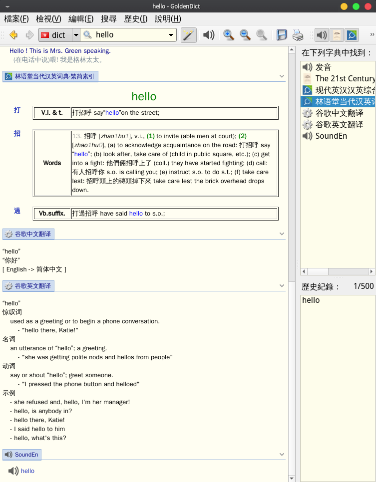

# GoldenDict
我的GoldenDict配置和词典收集  
[GoldenDict官网](http://goldendict.org)  
## 声明
本源的词库均来自网络收集,诺有侵害您的版权,请联系我(kaqi-w@hotmail.com)  
## 介绍
#### 包含词典:
- 21世纪大英汉词典
- 汉语字词典
- 林语堂当代汉英词典繁简
- 现代英汉汉英综合大辞典
- WyabdcRealPeopleTTS(支持英文发音)
- 谷歌翻译中英(支持划句翻译)
- 谷歌翻译英中(支持划句翻译)
#### 使用注意事项:
- 该config配置文件基于本人arch linux中提取,对于windows和macos操作系统无法保证可行性(可以尝试使用[欧陆词典](https://www.eudic.net/)).
- 下述操作基于arch linux
- 下述指令中的paru可以替换成您喜欢的包管理器
## 使用说明:
1. 安装goldendict和使用本源配置文件
```
paru -S goldendict
cd ~/Downloads && git clone https://github.com/kingarthurqi/goldendict.git  
mv ~/Downloads/goldendict/dict ~/Document
mv ~/Downloads/goldendict/config ~/.goldendict/
rm -rf ~/Downloads/goldendict
```
2. 添加谷歌翻译和发音支持
```
paru -S mpalyer translate-shell
```
3. 配置goldendict支持划线谷歌翻译
- 开启goldendict => 编辑 => 字典 => 程式 => 新增 => 开启<已启用> => 纯文本<类型> => 自定义<名称> => 命令列
- 谷歌英中翻译命令列:
```
trans -e google -s auto -t zh-CN -show-original y -show-original-phonetics n -show-translation y -no-ansi -show-translation-phonetics n -show-prompt-message n -show-languages y -show-original-dictionary n -show-dictionary n -show-alternatives n “%GDWORD%”
```
- 谷歌中英翻译命令列:
```
trans -e google -s auto -t en-US -show-original y -show-original-phonetics n -show-translation y -no-ansi -show-translation-phonetics n -show-prompt-message n -show-languages y -show-original-dictionary n -show-dictionary n -show-alternatives n “%GDWORD%”
```
4. 英文发音设置
- 开启goldendict => 编辑 => 偏好设置 => 音讯 => 勾选使用外部mplayer
5. 关于translate-shell访问[这里](https://github.com/soimort/translate-shell)
## 使用截图:


